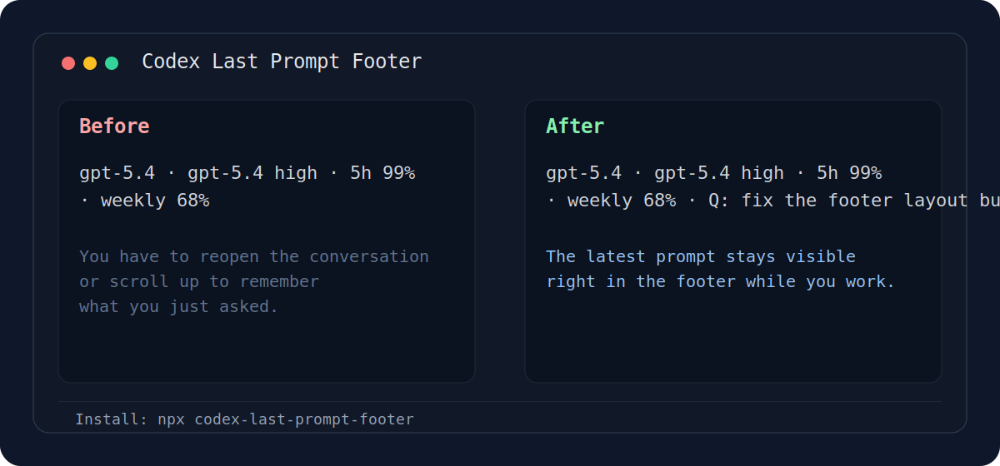

# Codex Last Prompt Footer

[](https://www.npmjs.com/package/codex-last-prompt-footer)
[](https://www.npmjs.com/package/codex-last-prompt-footer)
[](https://github.com/bic98/codex-last-prompt-footer)
[](./LICENSE)

`Codex Last Prompt Footer` keeps your latest prompt visible in the OpenAI Codex CLI footer with a live `Q: ...` preview next to the usual model and usage stats.



## Why This Is Useful

Codex CLI already shows useful footer information, but it does not remind you what your last prompt was. Once the session gets busy, that becomes annoying fast.

This project patches the official Codex CLI footer so the latest submitted prompt stays visible while you work.

Before:

```text
gpt-5.4 · gpt-5.4 high · 5h 99% · weekly 68%
```

After:

```text
gpt-5.4 · gpt-5.4 high · 5h 99% · weekly 68% · Q: fix the footer layout bug
```

## Why People Install It

- You stop reopening the conversation just to remember your last question.
- The patch is small and focused instead of replacing the whole CLI.
- Linux and macOS can install it with one `npx` command.
- Original launchers are backed up before replacement.
- It targets the official `openai/codex` Rust release tag.

## Install

### Linux / macOS

```bash
npx codex-last-prompt-footer
```

The installer automatically downloads a pre-built binary when available, so you can skip the Rust build entirely. If no pre-built binary exists for your platform, it falls back to building from source.

Alternative sources:

```bash
npx --yes github:bic98/codex-last-prompt-footer
```

```bash
git clone https://github.com/bic98/codex-last-prompt-footer.git
cd codex-last-prompt-footer
bash ./scripts/install.sh
```

### Windows PowerShell

```powershell
git clone https://github.com/bic98/codex-last-prompt-footer.git
cd codex-last-prompt-footer
powershell -ExecutionPolicy Bypass -File .\scripts\install.ps1
```

## Linux / macOS Troubleshooting

Codex CLI is a Rust binary. On Linux and sometimes macOS, the build may fail if OpenSSL development headers or `pkg-config` are missing.

Ubuntu / Debian:

```bash
sudo apt-get update && sudo apt-get install -y libssl-dev pkg-config build-essential
```

Fedora / RHEL:

```bash
sudo dnf install -y openssl-devel pkgconf-pkg-config gcc gcc-c++ make
```

Arch Linux:

```bash
sudo pacman -S --needed openssl pkgconf base-devel
```

macOS:

```bash
brew install openssl@3 pkg-config
```

If you hit `openssl-sys`, `pkg-config`, or `OpenSSL development headers` errors, install the packages above and rerun the command.

## Commands

Restore the original Codex launcher:

```bash
npx codex-last-prompt-footer restore
```

Build only:

```bash
npx codex-last-prompt-footer build
```

GitHub source alternative:

```bash
npx --yes github:bic98/codex-last-prompt-footer restore
npx --yes github:bic98/codex-last-prompt-footer build
```

Windows:

```powershell
powershell -ExecutionPolicy Bypass -File .\scripts\restore.ps1
powershell -ExecutionPolicy Bypass -File .\scripts\build.ps1
```

## What It Changes

1. Finds your existing `codex` launcher.
2. Downloads a pre-built patched binary (if available for your platform).
3. If no pre-built binary is available:
   - Installs Rust automatically if needed.
   - Checks native build dependencies on Linux/macOS.
   - Shallow-clones `openai/codex` at `rust-v0.114.0`.
   - Applies the footer patch.
   - Builds a patched `codex` binary.
4. Backs up your original launcher.
5. Repoints `codex` to the patched binary.

## Compatibility

Current target:

- `@openai/codex` `0.114.0`
- source tag `rust-v0.114.0`

Pre-built binaries are available for:

| Platform | Architecture |
|----------|-------------|
| Linux | x86_64, aarch64 |
| macOS | x86_64 (Intel), aarch64 (Apple Silicon) |
| Windows | x86_64 |

If no pre-built binary is available for your platform, the installer falls back to building from source automatically.

If OpenAI changes the footer implementation in a newer release, the patch may need to be refreshed.

## Cache Locations

Linux/macOS defaults:

```text
~/.codex-last-prompt-footer/openai-codex
~/.codex-last-prompt-footer/dist/posix/codex
```

Optional environment variables:

- `CODEX_TAG`
- `STATE_DIR`
- `SOURCE_DIR`
- `OUTPUT_DIR`

## Manual Patch Workflow

```bash
git clone https://github.com/openai/codex.git
cd codex
git checkout rust-v0.114.0
git apply /path/to/codex-v0.114.0-last-prompt-footer.patch
cd codex-rs
cargo +stable build -p codex-cli --release
```

## Search Terms

People usually find this repository while searching for things like:

- `openai codex cli footer`
- `codex cli prompt history`
- `codex latest prompt in status line`
- `codex footer patch`
- `codex cli npx install`
- `openssl-sys codex cli`
- `libssl-dev codex cli`
- `pkg-config codex cli`
